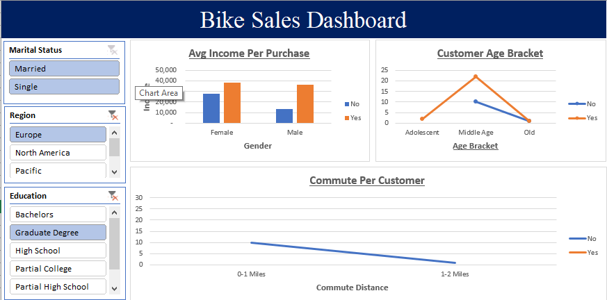

# 🚲 Bike Sales Analysis Dashboard

## 📌 Project Overview

This project analyzes customer demographic and socioeconomic data to identify factors that influence bike purchasing behavior.

Using Microsoft Excel, the data was cleaned, analyzed, and visualized through Pivot Tables, charts, and an interactive dashboard. The goal was to uncover patterns and insights that can help understand which customer groups are more likely to purchase a bike.

---

## 🎯 Project Objectives

The main objectives of this analysis were to:

* Analyze bike purchasing behavior across different customer demographics.
* Compare bike purchases by gender.
* Analyze the relationship between income and bike purchases.
* Determine how commute distance affects bike purchasing decisions.
* Analyze purchasing behavior across different age groups.
* Compare bike purchases by marital status.
* Explore regional differences in bike purchases.
* Create an interactive Excel dashboard to present key insights.

---

## 📊 Dataset

The dataset contains customer demographic and lifestyle information, including:

| Column           | Description                           |
| ---------------- | ------------------------------------- |
| ID               | Unique customer identifier            |
| Marital Status   | Customer's marital status             |
| Gender           | Customer gender                       |
| Income           | Customer annual income                |
| Children         | Number of children                    |
| Education        | Highest education level               |
| Occupation       | Customer occupation                   |
| Home Owner       | Whether the customer owns a home      |
| Cars             | Number of cars owned                  |
| Commute Distance | Distance travelled to work            |
| Region           | Customer's geographical region        |
| Age              | Customer age                          |
| Purchased Bike   | Whether the customer purchased a bike |

### Sample Data

| ID    | Marital Status | Gender |   Income | Children | Education       | Occupation     | Home Owner | Cars | Commute Distance | Region  | Age | Purchased Bike |
| ----- | -------------- | ------ | -------: | -------: | --------------- | -------------- | ---------- | ---: | ---------------- | ------- | --: | -------------- |
| 12496 | M              | F      |  $40,000 |        1 | Bachelors       | Skilled Manual | Yes        |    0 | 0-1 Miles        | Europe  |  42 | No             |
| 24107 | M              | M      |  $30,000 |        3 | Partial College | Clerical       | Yes        |    1 | 0-1 Miles        | Europe  |  43 | No             |
| 24381 | S              | M      |  $70,000 |        0 | Bachelors       | Professional   | Yes        |    1 | 5-10 Miles       | Pacific |  41 | Yes            |
| 25597 | S              | M      |  $30,000 |        0 | Bachelors       | Clerical       | No         |    0 | 0-1 Miles        | Europe  |  36 | Yes            |
| 27974 | S              | M      | $160,000 |        2 | High School     | Management     | Yes        |    4 | 0-1 Miles        | Pacific |  33 | Yes            |

---

## 🛠 Tools Used

* Microsoft Excel
* Excel Pivot Tables
* Pivot Charts
* Slicers
* Conditional Formatting
* Data Cleaning Techniques
* Data Visualization

---

## 🧹 Data Cleaning and Preparation

The dataset was prepared before analysis by:

* Checking for missing values.
* Checking for duplicate records.
* Standardizing column names.
* Formatting income values.
* Reviewing categorical variables.
* Creating additional columns where necessary.
* Preparing the dataset for Pivot Table analysis.

---

## 📈 Data Analysis

The analysis focused on several customer characteristics to understand bike purchasing behavior.

### 1. Average Income by Bike Purchase

Compared the income levels of customers who purchased bikes against those who did not.

**Key Question:**

> Does income influence bike purchasing behavior?

---

### 2. Bike Purchases by Gender

Analyzed the number of bike purchases between male and female customers.

**Key Question:**

> Which gender is more likely to purchase a bike?

---

### 3. Bike Purchases by Commute Distance

Analyzed how commuting distance affects the likelihood of purchasing a bike.

**Key Question:**

> Does commute distance influence bike purchasing decisions?

---

### 4. Bike Purchases by Age Group

Customers were grouped into age categories to analyze purchasing patterns.

Example categories:

* Young Adults
* Middle Age
* Older Adults

**Key Question:**

> Which age group purchases the most bikes?

---

### 5. Regional Bike Purchasing Behavior

Compared bike purchases across different geographical regions.

**Key Question:**

> Which region has the highest number of bike purchases?

---

### 6. Marital Status Analysis

Compared bike purchasing behavior between married and single customers.

**Key Question:**

> Does marital status influence bike purchasing decisions?

---

## 📊 Dashboard

The final dashboard provides an interactive overview of the key findings from the dataset.

The dashboard includes:

* Average Income by Gender
* Bike Purchases by Gender
* Bike Purchases by Commute Distance
* Bike Purchases by Age Group
* Regional Bike Purchase Analysis
* Marital Status Analysis
* Interactive Filters and Slicers

### Dashboard Preview





## 💡 Key Insights

The analysis helps identify patterns in customer behavior, including:

* Differences in bike purchasing behavior between male and female customers.
* The relationship between customer income and bike purchases.
* The impact of commute distance on bike purchasing decisions.
* Age groups with higher bike purchasing activity.
* Regional variations in bike purchases.
* The influence of marital status on purchasing behavior.


## 📁 Project Structure

```text
Bike-Sales-Analysis/
│
├── bike_buyers_project.xlsx
├── dashboard.png
└── README.md
```

---

## 🚀 Skills Demonstrated

This project demonstrates practical skills in:

* Data Cleaning
* Data Analysis
* Excel Functions
* Pivot Tables
* Pivot Charts
* Data Visualization
* Dashboard Development
* Business Insight Generation
* Data Storytelling

---

## 📌 Conclusion

This project demonstrates how Microsoft Excel can be used as a powerful tool for data analysis and visualization.

By analyzing customer demographic and socioeconomic information, the project identifies patterns that can help businesses better understand customer behavior and the factors that may influence purchasing decisions.

The interactive dashboard makes it easier to explore the data and communicate insights in a clear and visually understandable way.

---

## 👤 Author

**Duke Mochama**

Aspiring Data Analyst | Information Technology Graduate

### Connect with me

* LinkedIn: https://www.linkedin.com/in/duke-mochama-27257525b/
* GitHub: https://github.com/DukeMochama2022/
